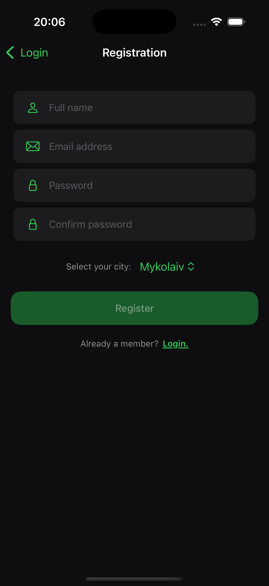
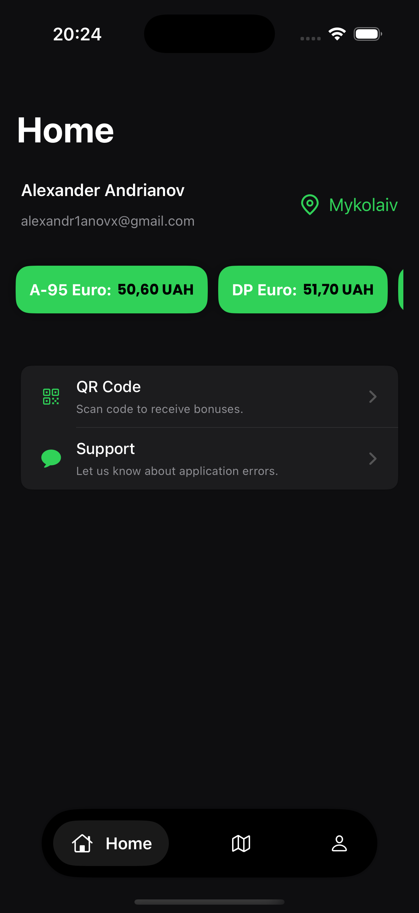
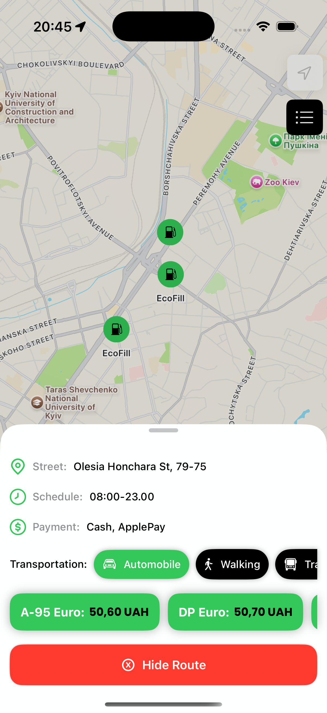
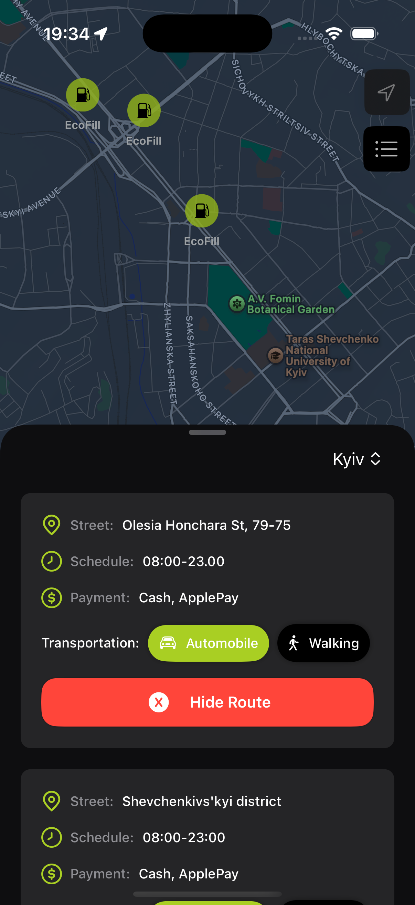

# ⛽️ EcoFill

iOS application designed for a network of gas stations, built using SwiftUI and the MVVM architecture. It leverages Firebase for user authentication, data storage, and real-time updates. The app provides users with up-to-date fuel prices and navigation to nearby stations.

## Tech Stack

- Language: Swift.
- UI Framework: SwiftUI.
- Architecture: MVVM.
- Backend: Firebase (Authentication, Firestore).

## Features

- **live fuel prices** – view real-time fuel prices for all types of fuel without needing to visit a station.
- **station navigation** – tap a station on the map or from the list to get full details and build a route from your current location.
- **qr-code** – display your personal QR code or scan another using the built-in camera.
- **profile & settings** – manage your profile, change the app’s theme and language, update email, or delete your account.

## Screenshots

  
  
  
  
  

