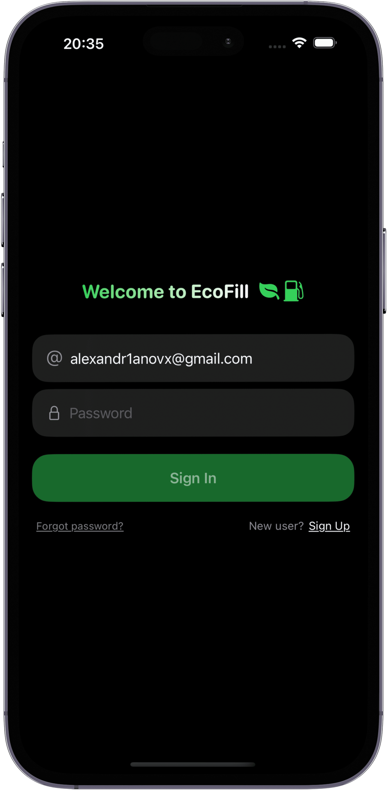
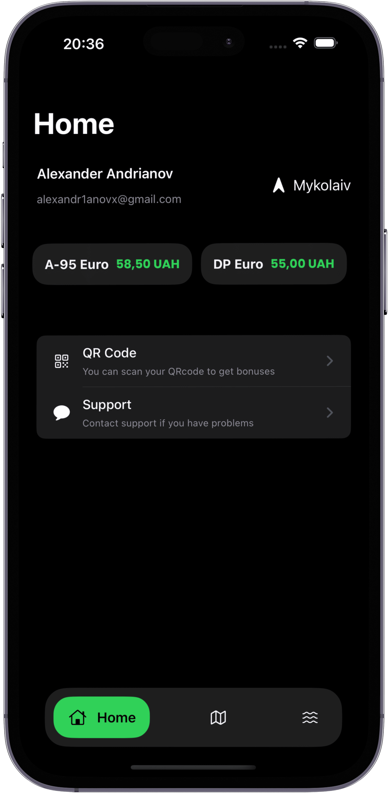
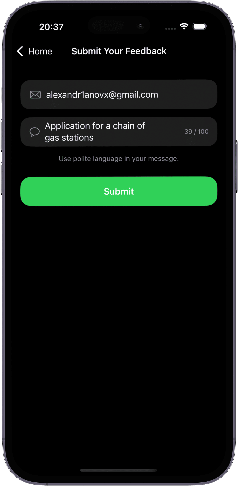
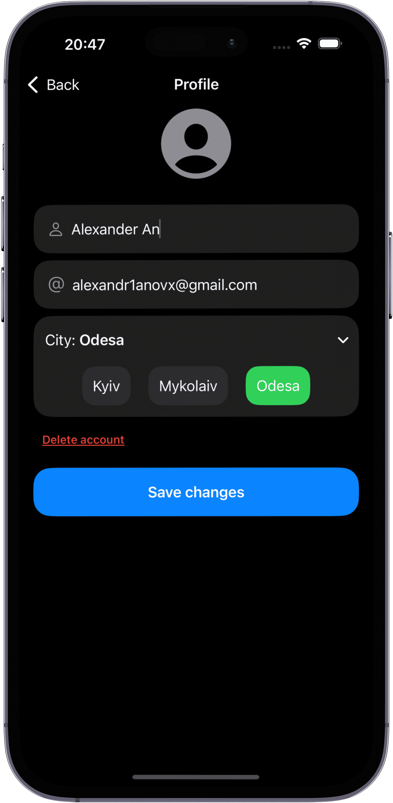

#  EcoFill

An iOS app designed for a network of gas stations.  
It provides users with up-to-date fuel prices and navigation to the nearest gas stations.

**features**:
- real-time prices for all types of fuel without needing to visit a station.
- select a station on the map or from the list to get full details and build a route from your current location.

**iOS 17+**.

---

## screenshots:
<p align="center">
   
   
   
   
   
   
   
   
   
  
</p>

---

## tech stack
- Swift, SwiftUI, MVVM, MapKit, Firebase (Authentication, Firestore).

---

## installation:
```bash
git clone https://github.com/alexandr1anov/EcoFill.git
